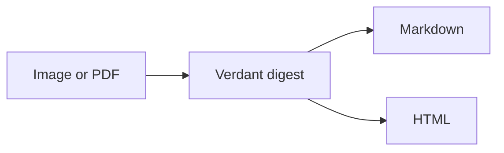

# Sample process

A tiny truth fixture for Verdant evals.

## Flow

```mermaid
flowchart LR
  A[Image or PDF] --> B[Verdant digest]
  B --> C[Markdown]
  B --> D[HTML]
```

## Notes

- Preserve headings
- Emit Mermaid for diagrams
- Keep artifact image refs when figures matter
