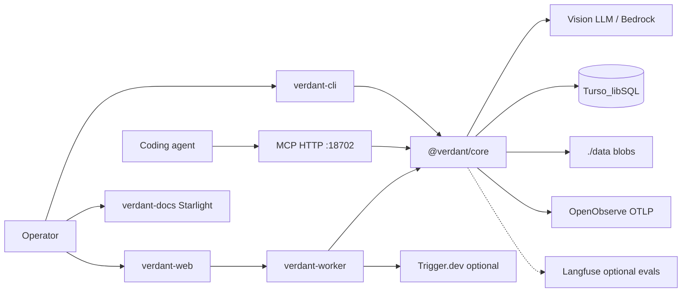

# Architecture

Verdant is a **Docker Compose monorepo**: Next.js Web UI, Node worker + CLI/MCP, Astro
Starlight docs, shared `@verdant/core` digest library, plus self-hosted OpenObserve,
Langfuse, and Trigger.dev sidecars. Operator **blobs** live on a host bind mount (`./data`);
**operational state** lives in embedded Turso/libSQL under `data/turso/`.

## Context diagram

## Components

| Component | Responsibility | Depends on |
|---|---|---|
| `apps/web` | Upload UI, settings drawer, job list, run preview | Worker HTTP APIs, `data/` blobs |
| `apps/cli` | CLI commands + MCP server + worker queue loop | `@verdant/core` |
| `packages/core` | Diagnose, rasterize, plan, page digest, validate, stitch, jobs, providers, DB | Poppler, Sharp, LLM SDKs, libSQL |
| `apps/docs` | End-user Starlight site | Static content only |
| `trigger/` | Optional Trigger.dev task definitions | `@verdant/core`, Trigger API |
| `infra/openobserve` | Ops traces/logs/metrics (persistent volume) | Compose network |
| `infra/langfuse` | Optional LLM traces/evals stack | Compose network |
| `infra/trigger` | Bootstrap pinned Trigger self-host | Host Docker |

## Data model

| Entity | Location | Notes |
|---|---|---|
| Input file | `data/inputs/…` | Uploads / CLI paths (blob) |
| Job / events / plan / pageProgress | Turso `jobs` + `job_events` | Source of truth; migrated from `data/jobs/*.json` |
| LLM settings | Turso `settings` | Migrated from `data/config.json` |
| Run reviews | Turso `reviews` | Migrated from `outputs/*/review.json` |
| Outputs | `data/outputs/<runId>/` | `document.md`, `document.html`, `pages/`, `artifacts/` (blobs) |
| Truth fixtures | `data/datasets/<case-id>/` | `input.*` + `expected.md` |
| libSQL file | `data/turso/verdant.db` | `TURSO_DATABASE_URL=file:/data/turso/verdant.db` |

## Domain language and boundaries

| Domain concept | Meaning in this project | Boundary / owner |
|---|---|---|
| Digest | Full pipeline from input to stitched document | `@verdant/core` |
| Plan | Which pages to digest vs skip | diagnose + plan.json on disk + job row |
| Page work | Per-page vision digest with validate/retry/resume | page jobs |
| Stitch | IR assemble (keep compile + chrome fingerprint strip) when `VERDANT_EXTRACT_MODE=ir`; else deterministic Markdown join (`VERDANT_STITCH_MODE=code`) or optional LLM stitch | see [ADR-0004](adrs/0004-code-first-stitch-and-ir.md), [ADR-0005](adrs/0005-extraction-ir-dual-stream.md) |
| Job | Async run tracked for UI/CLI/MCP | Turso jobs module + worker |

## Key flows

### Multipage PDF digest

1. Client enqueues file (Web/CLI/MCP) → worker picks job (Turso `queued` → `running`).
2. Diagnose page count; rasterize with Poppler to disk.
3. Plan blank/sparse/content pages → `plan.json` + job `plan_json`.
4. Digest content pages (concurrency env); validate; retry once; resume valid pages.
5. Copy rasters to `artifacts/`; stream `pageProgress` + `job_events`.
6. Stitch pages → `document.md`; optional HTML + Mermaid.
7. UI/MCP read outputs from `data/outputs/<runId>/`; status from Turso via worker.

### LLM settings

1. Operator opens Settings drawer → selects provider.
2. Tests credentials → persist Turso `settings` → load models.
3. Digests resolve active provider (UI config over `.env` fallbacks).

## Cross-cutting concerns

- **AuthN/Z:** Local trust model; no multi-tenant auth in Verdant itself. Langfuse/Trigger/
  OpenObserve have their own local logins.
- **Secrets:** `.env` (gitignored) + Turso settings (API keys in DB under `./data`).
- **Observability:** OpenObserve (primary OTLP); optional Langfuse; job events in UI;
  container logs.
- **Docs split:** Operator how-tos in `apps/docs` (Starlight); product/engineering truth in
  repo `docs/` (DocSlime). See [ADR 0001](adrs/0001-docs-split-starlight-and-docslime.md).

## Decisions

| Decision | ADR |
|---|---|
| Starlight for end users; DocSlime `docs/` for product/engineering | [0001](adrs/0001-docs-split-starlight-and-docslime.md) |
| Multipage PDF via Poppler + page digests + stitch | [0002](adrs/0002-multipage-pdf-pipeline.md) |
| Host ports clustered in 187xx | [0003](adrs/0003-host-port-cluster-187xx.md) |
| Database-as-state (Turso) + OpenObserve primary ops telemetry | [0006](adrs/0006-database-as-state-turso-openobserve.md) |

## Open questions

- Make Trigger the sole execution path vs keep filesystem/Turso queue as default local reliability.
- Optional Turso Cloud remote sync for multi-machine operators.
